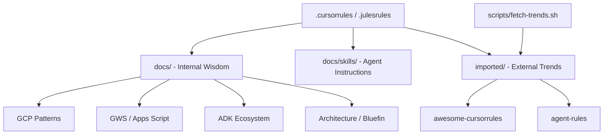

# 🌐 WTG Knowledge Base (wtg-kb)
### *The Ultimate Solution Architect Brain for GCP & GWS*


Welcome to your centralized "Second Brain" for software development and solution architecture. This repository is specifically designed to be consumed by **Agentic IDEs** while maintaining a professional documentation site for humans.

---

## 🏗️ Architecture: The "Brain" Design



### Key Components
- **docs/**: Your curated, project-specific knowledge.
- **docs/skills/**: "Hardened" instructions for AI agents to perform complex tasks.
- **imported/**: Live submodules of the industry's best AI rules.
- **llms.txt**: A machine-readable "Map" for AI crawlers and tools.

---

## 🚀 Quick Start: Agent Integration

### 1. Cursor & Jules
These tools use the root `.cursorrules` and `.julesrules` to understand your persona (Solution Architect) and your preferred tech stack (GCP/GWS).
> **Tip:** Symlink these files to your active projects to carry your "Brain" with you.

### 2. Antigravity (Google)
Configure Antigravity to use `docs/skills/` as its primary reference for GWS automation. See [AGENT_GUIDE.md](AGENT_GUIDE.md) for details.

### 3. Google Apps Script (clasp)
Developed patterns for local Node.js emulation and CI/CD via GitHub Actions (with WIF) are located in `docs/gcp/apps-script.md`.

---

## 💎 The "GDE" Advantage
This KB incorporates patterns and libraries from leading Google Developer Experts:
- **Bruce McPherson:** Emulating GAS with `gas-fakes`, local debugging, and Workload Identity Federation.
- **Kanshi Tanaike:** Performance optimizations for high-scale GWS integrations.

---

## 🛠️ Maintenance
To keep your brain updated with the latest trends:
```bash
./scripts/fetch-trends.sh
```

See [TODO.md](TODO.md) for the upcoming roadmap.
