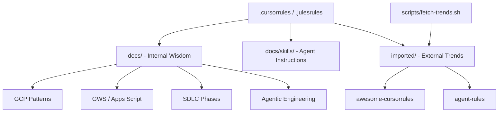

# 🌐 WTG Knowledge Base (wtg-kb)
### *The Ultimate Solution Architect Brain for GCP & GWS*

[](https://github.com/wtg-codes/wtg-kb/actions/workflows/deploy.yml)
[](https://docusaurus.io/)
[](https://opensource.org/licenses/MIT)
[](https://cloud.google.com/)
[](https://wtg-codes.github.io/wtg-kb/docs/agents/templates)

Welcome to your centralized **"Second Brain"** for software development and solution architecture. This repository is a dual-purpose system: a **machine-readable knowledge graph** for Agentic IDEs and a **high-end documentation suite** for humans.

---

## 🏗️ Architecture: The "Brain" Design



### 🧠 Core Philosophy
1. **Agent-First**: Structure is optimized for LLM context windows and RAG ingestion.
2. **Glassy UX**: The human-facing site uses a modern, semi-transparent dark aesthetic.
3. **Modular Knowledge**: External trends are piped in via Git submodules to stay evergreen.

---

## 🚀 Quick Start: Agent Integration

### 1. Cursor, Jules & Antigravity
The root `.cursorrules` and `.julesrules` provide global context for your persona (Solution Architect) and preferred tech stack.
> **Tip:** Symlink these rules to your active project roots to synchronize your "Brain" across repos.

### 2. Multi-Agent Templates
Access standardized prompt formats and rule definitions in the [Agent Rules](https://wtg-codes.github.io/wtg-kb/docs/agents/templates) section.

---

## 🛠️ Maintenance & Automation
- `./scripts/check-compliance.sh`: Validates structure and link integrity.
- `./scripts/fetch-trends.sh`: Syncs external knowledge submodules.
- `./scripts/generate-manifest.sh`: Updates the machine-readable `llms.txt`.

---

## 🖥️ Documentation Site
Live site: https://wtg-codes.github.io/wtg-kb/

### Local Development
```bash
npm install
# To start the dev server locally:
npm run start
```

---

## 📝 Manual Setup & Pending Configurations
*The following items require manual intervention or represent current environment constraints:*

1. **GitHub Pages Deployment**: Ensure "Settings > Pages" is set to "GitHub Actions" as the source.
2. **Submodule Sync**: Run `git submodule update --init --recursive` after cloning.
3. **Vertex AI Search**: To enable RAG, configure a Search & Conversation app pointing to your GCS bucket synced via `scripts/vertex-ai-sync.sh`.

---
*Built with ❤️ by Working Title Group*
