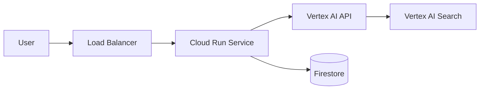
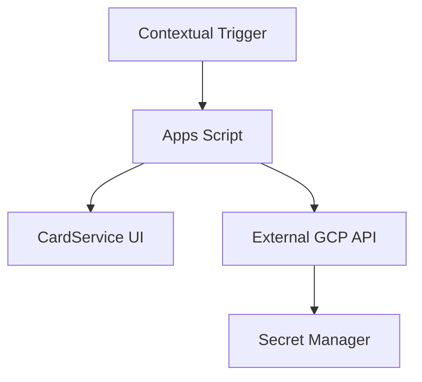
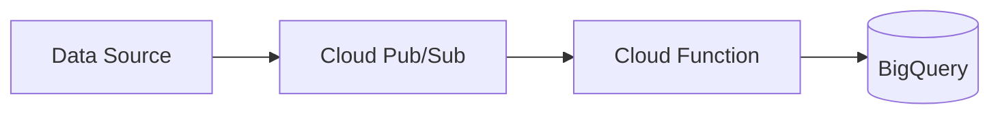

# Standard Architecture Patterns

Common architectural designs for GCP and GWS solution design.

## Cloud Run + Vertex AI (Agentic Backend)

## GWS Add-on (CardService Architecture)

## Event-Driven Pattern (Pub/Sub)

